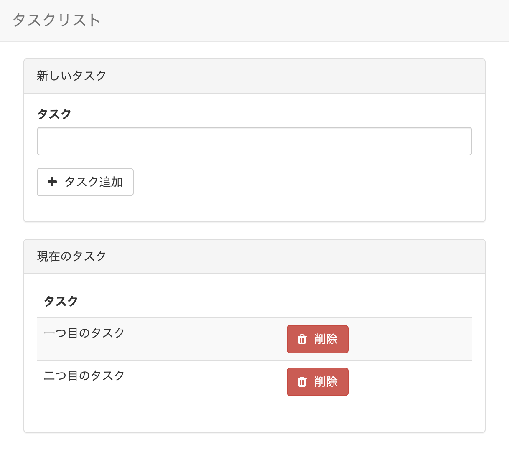

# Laravel 6.0 基本のタスクリスト

```
$ git clone git@github.com:ucan-lab/laravel60-quickstart-basic
$ cd laravel60-quickstart-basic
$ docker-compose up -d --build
$ docker-compose exec app composer install
$ docker-compose exec app cp .env.example .env
$ docker-compose exec app php artisan key:generate
$ docker-compose exec app php artisan migrate
```

http://127.0.0.1:10080


